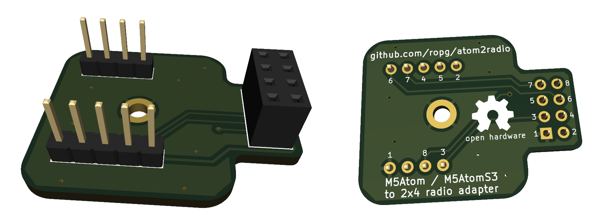
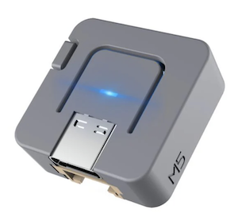
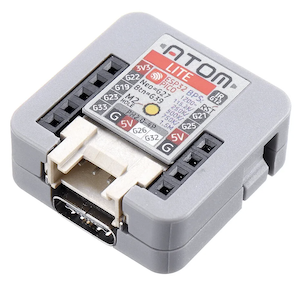
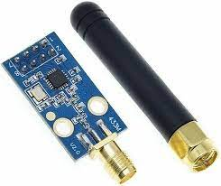

# atom2radio

Very simple passive adapter board to hook an M5Stack M5Atom or M5AtomS3 ESP32 unit to any of the common 2x4 pin header radio boards. Just upload the included [board file](atom2radio.kicad_pcb) file to your favorite PCB manufacturing place. (If you don't have a favorite, I used [this place](https://aisler.net/) and was happy. They will send you three of these little boards for €13.45 including VAT.)

&nbsp;&nbsp;&nbsp;&nbsp;&nbsp;
